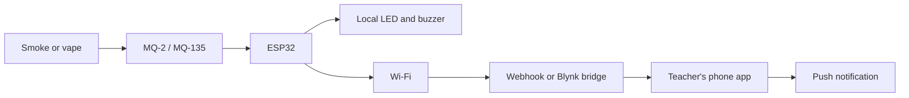

# SnoopSmoke Sensor

SnoopSmoke is an ESP32-based smoke and environmental alert prototype. It reads an MQ-series gas/smoke sensor and a DHT11, activates local indicators, and can forward state-change alerts over Wi-Fi to either a custom app or a Blynk integration.



## Important: what the photos confirm

The attached photos appear to show a classic ESP32 DevKit-style board, an MQ-series sensor, a blue DHT11 module, a buzzer, a pushbutton, and a perfboard. They do not make the GPIO labels or every soldered wire unambiguous.

Therefore:

- The pin map below is a recommended universal target for a classic ESP32 DevKit-style board, not a claim about the existing solder joints.
- Do not energize the board until each wire is traced with a multimeter or continuity tester.
- If the physical board is an ESP32-S3, C3, or another variant, verify its pinout before using these defaults.

## Recommended universal pin contract

The firmware defaults are in `SnoopSmoke_Sensor/SnoopSmoke_Sensor.ino` and can be overridden in the ignored local `SnoopSmoke_Sensor/SnoopSmoke_Config.h` file.

| Function | ESP32 GPIO | Connection | Notes |
| --- | ---: | --- | --- |
| MQ-2/MQ-135 analog output | 34 | Sensor `AO` → GPIO34 | ADC1, input-only on classic ESP32; keep the analog signal at or below the ESP32-safe voltage. |
| DHT11 data | 4 | Module `S`/`DATA` → GPIO4 | Power the common 3-pin module from 3.3 V. A bare DHT11 needs a pull-up resistor. |
| Alert LED | 26 | GPIO26 → 220–330 Ω resistor → LED anode | LED cathode to GND. External LED is preferred over a board-specific built-in LED. |
| Active buzzer | 25 | GPIO25 → buzzer driver/input | Use a transistor or suitable driver if the buzzer draws more current than an ESP32 GPIO can supply. |
| Optional acknowledge button | 27 | GPIO27 → pushbutton → GND | Reserved for a future mute/acknowledge feature; firmware currently does not require it. |
| Common ground | GND | All modules and supplies share GND | A shared ground is required for reliable readings. |

### Power and voltage safety

1. MQ-2 and MQ-135 modules commonly need a 5 V heater supply. Do not assume the ESP32 3.3 V pin can power the heater.
2. A 5 V-powered MQ module may produce an analog output above 3.3 V. Use a voltage divider or a level-safe sensor board before connecting `AO` to GPIO34. For a nominal 5 V signal, a 10 kΩ high-side resistor and 20 kΩ low-side resistor gives approximately 3.3 V at the ESP32 input; confirm the actual module output with a meter.
3. Power the DHT11 logic from 3.3 V unless the exact module datasheet says otherwise.
4. Do not connect an unknown 5 V signal directly to an ESP32 GPIO.
5. Use ADC1 pins for analog sensors when Wi-Fi is enabled. On the classic ESP32, ADC2 is shared with Wi-Fi and can fail while Wi-Fi is active. [Espressif ADC guidance](https://docs.espressif.com/projects/esp-idf/en/latest/esp32/api-reference/peripherals/adc.html)

## Firmware behavior

The current sketch:

- Samples the MQ sensor and DHT11 every two seconds.
- Reports `NORMAL`, `POSSIBLE SMOKE`, or `SMOKE DETECTED`.
- Turns on the alert LED for warning/detection and the active buzzer for detection.
- Detects failed DHT reads and sends `null` rather than `nan` in JSON.
- Reconnects to Wi-Fi without stopping local monitoring.
- Sends an alert only when the smoke state changes, then retries a pending alert if the network is unavailable.
- Sends no cloud data until a local webhook URL is configured.

### Configure Wi-Fi without committing secrets

1. Copy `SnoopSmoke_Sensor/SnoopSmoke_Config.h.example` to `SnoopSmoke_Sensor/SnoopSmoke_Config.h`.
2. Fill in the Wi-Fi SSID and password.
3. Set `SNOOPSMOKE_ALERT_WEBHOOK_URL` to the HTTPS endpoint for the selected app path.
4. Optionally set `SNOOPSMOKE_ALERT_API_KEY`.
5. Change the pin overrides only after the wiring has been traced.

`SnoopSmoke_Config.h` is ignored by Git. Never commit Wi-Fi passwords, Blynk device tokens, or API keys.

## First upload: diagnostic firmware

Do not upload the production sensor firmware to an unknown soldered prototype yet. Use `SnoopSmoke_Diagnostics/SnoopSmoke_Diagnostics.ino` first.

This utility is deliberately conservative:

- At startup it identifies the ESP32 chip, revision, CPU, flash, heap, SDK, MAC address, compile target, and target family.
- It can scan nearby Wi-Fi networks without credentials or connecting to them.
- It prints the ADC1 candidate pins for a classic ESP32.
- Its optional ADC scan is disabled by default and only reads pins as high-impedance inputs after the engineer confirms voltage safety.
- Its DHT test is disabled until a specific, verified data GPIO is configured.
- It never drives unknown GPIOs and cannot automatically infer arbitrary soldered connections.

No firmware can safely discover whether an unknown wire carries 3.3 V, 5 V, an external output, or a sensor signal. That requires the board label, schematic/trace information, and a multimeter.

### Diagnostic procedure for the engineer

1. Disconnect external power from the perfboard.
2. Identify the exact ESP32 board marking and photograph the pin labels.
3. Photograph both sides of the MQ module, including its pin labels and supply markings.
4. Confirm that no unknown GPIO is being driven above 3.3 V before connecting USB.
5. Open `SnoopSmoke_Diagnostics/SnoopSmoke_Diagnostics.ino` in Arduino IDE.
6. Select the board matching the marking, then select the COM port.
7. Click **Verify**, upload, and open Serial Monitor at `115200` baud.
8. Send `i`, `p`, and `w` from the Serial Monitor.
9. Do not send `a` or `d` until the engineer has verified the relevant GPIO and configured the diagnostic header.
10. Send the complete serial output and close-up photos back for pin mapping.

The diagnostic output can identify the board family and Wi-Fi environment, but it cannot prove that GPIO34 is connected to `AO`, that GPIO4 is connected to DHT data, or that any MQ analog voltage is safe.

### Alert payload

The firmware sends a JSON `POST` on a state change:

```json
{
  "device": "snoopsmoke-01",
  "event": "SMOKE_DETECTED",
  "status": "SMOKE DETECTED",
  "smoke": 842,
  "temperature": 28.4,
  "humidity": 65.0,
  "wifi_rssi": -57
}
```

Possible events are `POSSIBLE_SMOKE`, `SMOKE_DETECTED`, and `CLEAR`. DHT values are `null` when a read fails.

## Choose the phone-alert path

The sensor firmware uses a vendor-neutral webhook so the hardware does not need to be rewritten when the phone app changes.

### Option A: Blynk

Use a small HTTPS relay that accepts the SnoopSmoke JSON, writes the readings to Blynk datastreams, and triggers a Blynk event for `POSSIBLE_SMOKE` or `SMOKE_DETECTED`.

Suggested datastreams:

| Datastream | Type | Meaning |
| --- | --- | --- |
| `smoke` | Integer | Raw calibrated MQ reading |
| `temperature` | Double | DHT11 temperature in °C |
| `humidity` | Double | DHT11 relative humidity |
| `status` | String | Current state |
| `wifi_rssi` | Integer | ESP32 Wi-Fi signal level |

Create Blynk Events for the warning and detected states, then enable push notifications for the intended recipients. Blynk documents datastreams and event-based notifications in its [Datastream documentation](https://docs.blynk.io/en/blynk.console/templates/datastreams) and [Notifications documentation](https://docs.blynk.io/en/getting-started/notification-management).

### Option B: our own app

Implement `POST /api/alerts` in the app backend. The endpoint should:

1. Verify `X-API-Key`.
2. Validate `device`, `event`, and numeric ranges.
3. Store the latest telemetry and event history.
4. Send a push notification only for `SMOKE_DETECTED` and optionally `POSSIBLE_SMOKE`.
5. Rate-limit repeated events and provide a `CLEAR` notification/state.

Wi-Fi only connects the ESP32 to the network. Push notifications require the endpoint to be reachable and an app notification service to be configured.

### First software checkpoint: vendor-neutral backend and dashboard

The repository now contains a small backend in `backend/`. It uses Node.js 18 or newer and has no third-party npm dependencies.

Install the Node.js 18+ LTS runtime first if the `node` command is not available. No `npm install` step is needed for this first checkpoint.

It implements:

- `POST /api/alerts` with `X-API-Key` or Bearer-token authentication.
- Payload validation for the current ESP32 JSON contract.
- JSON-backed current device state and event history.
- Device/room/status/readings, online timeout, and last detection time.
- Notification cooldown so repeated detections do not spam the teacher.
- `GET /api/state`, `GET /api/events`, and `GET /api/devices/:deviceId` for the dashboard.
- A simple web dashboard at `/`.
- Optional Blynk datastream/event relay.
- Optional notification-provider webhook. This webhook is an integration point; it does not create phone push notifications by itself.

#### Run it locally

From PowerShell in the repository root:

```powershell
Copy-Item backend/.env.example backend/.env
notepad backend/.env
node backend/server.mjs
```

Set a real local value for `SNOOPSMOKE_DEVICE_API_KEY` in `backend/.env`. Do not commit that file. The dashboard is then available at `http://127.0.0.1:8787/`.

For a same-Wi-Fi ESP32 test, set `SNOOPSMOKE_HOST=0.0.0.0`, set a dashboard API key, allow the port through the laptop firewall only on the private network, and set the firmware webhook to `http://LAPTOP_LAN_IP:8787/api/alerts`. Do not expose this development server directly to the public internet.

The backend stores development data in the ignored file `backend/data/state.json`. To test the endpoint without an ESP32, use a JSON request with the same API key:

```powershell
$headers = @{ "X-API-Key" = "replace-with-a-long-random-device-key" }
$body = @{
  device = "snoopsmoke-01"
  event = "SMOKE_DETECTED"
  status = "SMOKE DETECTED"
  smoke = 842
  temperature = 28.4
  humidity = 65.0
  wifi_rssi = -57
} | ConvertTo-Json

Invoke-RestMethod -Method Post -Uri http://127.0.0.1:8787/api/alerts -Headers $headers -ContentType "application/json" -Body $body
```

The dashboard should show the device, `ROOM-001`, `SMOKE DETECTED`, raw smoke value `842`, and an event-history row. The backend assigns the configured room when the current firmware payload does not include one.

#### Blynk relay configuration

The backend uses Blynk's device HTTPS API, so the ESP32 remains unaware of Blynk. Configure these datastreams in the Blynk template/device:

| Virtual pin | Datastream | Type |
| --- | --- | --- |
| `V0` | smoke | Integer |
| `V1` | temperature | Double |
| `V2` | humidity | Double |
| `V3` | status | String |
| `V4` | wifi_rssi | Integer |

Create Blynk Events with these exact event codes:

| Event | Code | Default notification behavior |
| --- | --- | --- |
| Possible Smoke | `possible_smoke` | Enabled, cooldown protected |
| Smoke Detected | `smoke_detected` | Enabled, cooldown protected |
| Clear | `clear` | Logged; push disabled by default |

Put the Blynk device token only in local `backend/.env` as `BLYNK_AUTH_TOKEN`. The relay calls Blynk's [datastream update API](https://docs.blynk.io/en/blynk.cloud/device-https-api/update-multiple-datastreams-api) and [event API](https://docs.blynk.io/en/blynk.cloud/device-https-api/trigger-events-api). Blynk event notification limits and account settings still apply.

#### Push notifications

The custom dashboard records events but does not pretend that a browser page is a phone push service. To send real push notifications, configure a provider or a small relay that accepts `SNOOPSMOKE_NOTIFICATION_WEBHOOK_URL` and forwards valid detection events through a service such as Firebase Cloud Messaging, ntfy, Pushover, or an institution-approved provider. Keep that provider credential outside Git.

This first backend checkpoint is suitable for local/simulated testing. Before exposing it to the public internet, deploy it behind HTTPS, keep both API keys secret, and harden the ESP32 HTTPS client certificate validation.

## Calibration and testing sequence

The MQ threshold values are raw ADC values, not certified ppm values and not a reliable way to identify a specific substance. MQ-2/MQ-135 sensors respond to multiple gases and require warm-up and calibration.

1. Verify the exact ESP32 model and trace every wire.
2. Power the MQ module safely and confirm the analog voltage with a multimeter.
3. Upload with the webhook URL empty first.
4. Open Serial Monitor at `115200` baud.
5. Allow the MQ sensor to warm up according to its datasheet.
6. Record clean-air readings and controlled test readings.
7. Set warning and detection thresholds in the local config or sketch.
8. Test the LED/buzzer locally before enabling cloud notifications.
9. Enable the webhook and verify one warning, one detection, and one clear event.
10. Test Wi-Fi loss and recovery before relying on the system for supervision.

This is a prototype alert system, not a certified fire, health, or security alarm. It cannot reliably distinguish smoke from vape aerosol without additional sensing, calibration, and testing.

## Compile and upload

The sketch is an Arduino project in `SnoopSmoke_Sensor/`.

With Arduino CLI:

```text
arduino-cli compile --fqbn esp32:esp32:esp32 SnoopSmoke_Sensor
arduino-cli upload -p YOUR_PORT --fqbn esp32:esp32:esp32 SnoopSmoke_Sensor
```

With Arduino IDE, open `SnoopSmoke_Sensor/SnoopSmoke_Sensor.ino`, select the matching ESP32 board and port, click Verify, then Upload. Open Serial Monitor at `115200` baud.

The last verified build used ESP32 core `3.3.11`, DHT sensor library `1.4.7`, and Adafruit Unified Sensor `1.1.15`.

## Project status

| Area | Status |
| --- | --- |
| ESP32 local sensor firmware | Implemented |
| DHT11 failure handling | Implemented |
| Wi-Fi reconnect | Implemented |
| Vendor-neutral webhook payload | Implemented; backend endpoint available locally at `/api/alerts` |
| Universal target pin map | Documented, not yet verified against the soldered board |
| Vendor-neutral backend/dashboard | Implemented, local configuration and hosting pending |
| Blynk relay/app | Relay implemented, live credentials/template not tested |
| Custom teacher app | Web dashboard implemented; native app not planned for first checkpoint |
| Push notifications | Provider integration pending |
| MQ calibration | Pending physical warm-up/testing |
| Hardware runtime test | Pending verified wiring and board access |

## References

- [Arduino ESP32 Wi-Fi API](https://docs.espressif.com/projects/arduino-esp32/en/latest/api/wifi.html)
- [Arduino ESP32 ADC API](https://docs.espressif.com/projects/arduino-esp32/en/latest/api/adc.html)
- [Blynk datastreams](https://docs.blynk.io/en/blynk.console/templates/datastreams)
- [Blynk events and notifications](https://docs.blynk.io/en/blynk.console/templates/events)
